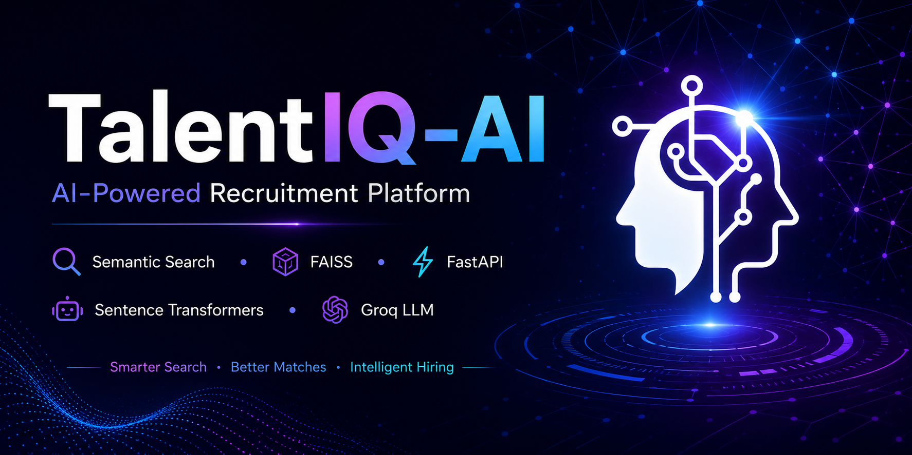
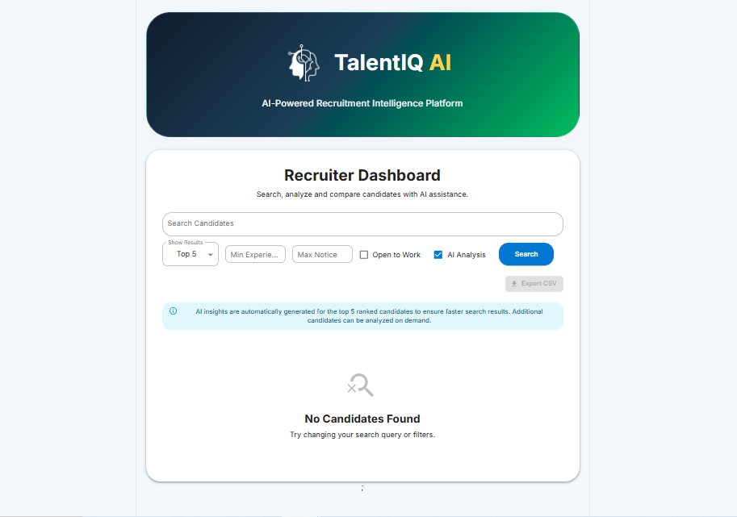
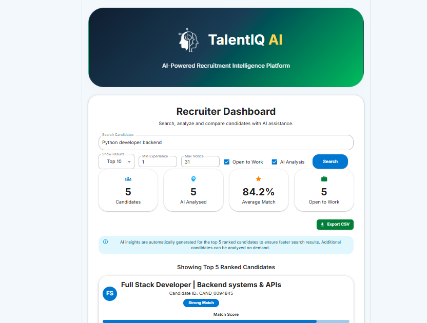
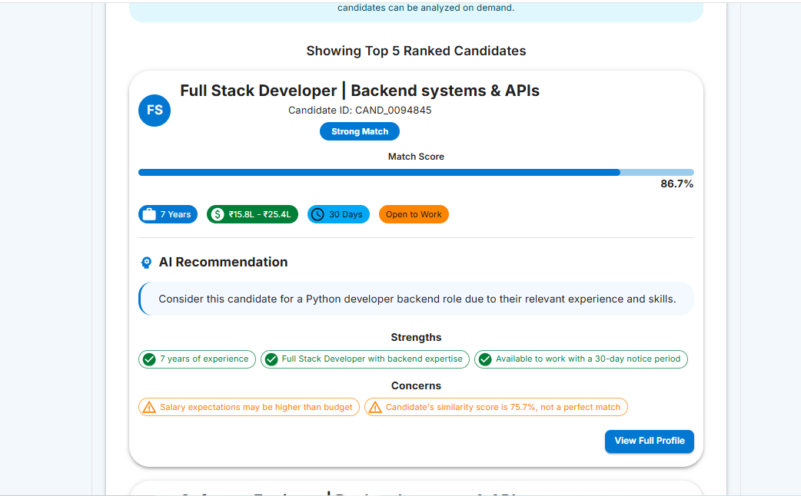
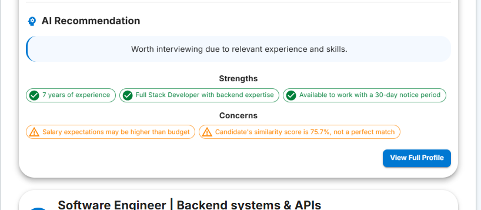
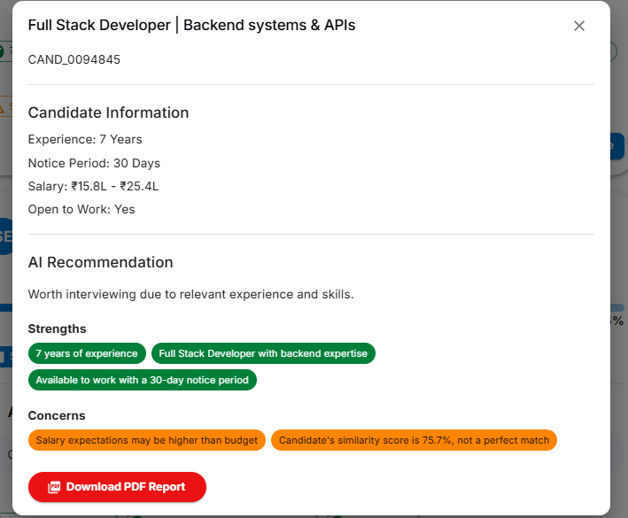
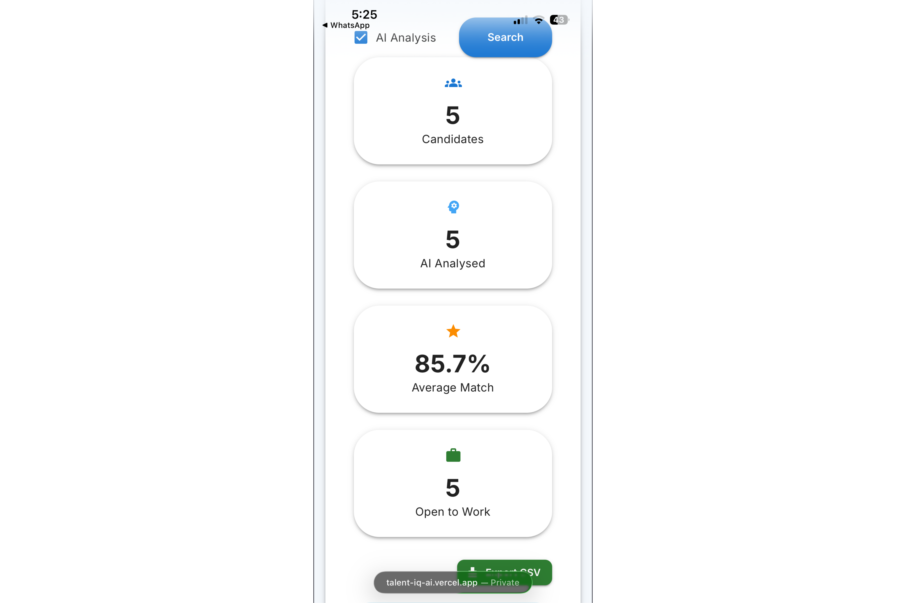

<p align="center">
  
</p>

<h1 align="center">TalentIQ-AI</h1>


<p align="center">
<a href="https://talent-iq-ai.vercel.app/">

</a>

<a href="https://github.com/VinayakKSatheesh/TalentIQ-AI">

</a>
</p>


<div align="center">

### AI-Powered Recruitment Platform using Semantic Search, Vector Search & Large Language Models

*Discover the right talent through AI-driven semantic search, intelligent ranking, and explainable candidate analysis.*


**Backend API:** https://talentiq-ai.up.railway.app/

</div>

---

## 📖 Overview

TalentIQ-AI is an AI-powered recruitment platform that enables recruiters to search and evaluate candidates using semantic understanding rather than traditional keyword matching.

The platform combines modern Natural Language Processing (NLP), vector search, and Large Language Models (LLMs) to identify highly relevant candidates, explain why they match a job requirement, and provide recruiter-friendly insights in real time.

Instead of relying solely on exact keyword matches, TalentIQ-AI understands the meaning behind recruiter queries, resulting in more accurate candidate recommendations.

---

## ✨ Key Features

* 🔍 AI-powered semantic candidate search
* ⚡ High-performance FAISS vector retrieval
* 🧠 Sentence Transformer embeddings
* 🤖 LLM-powered candidate analysis using Groq
* 📊 Hybrid candidate ranking
* 🗂 Recruiter-friendly candidate intelligence
* 📄 Explainable AI recommendations
* 📱 Fully responsive React interface
* ☁️ Automatic FAISS index download from Hugging Face
* 🚀 Cloud deployment using Railway & Vercel

---

## 🚀 Project Status

**Status:** 🟢 Production Ready

TalentIQ-AI is fully functional and deployed with:

* Frontend hosted on Vercel
* Backend deployed on Railway
* FAISS vector index hosted on Hugging Face
* Groq LLM integration for candidate analysis


## 🛠️ Technology Stack

### Frontend

| Technology         | Purpose                         |
| ------------------ | ------------------------------- |
| React + TypeScript | Modern frontend development     |
| Vite               | Fast development and build tool |
| Material UI (MUI)  | Responsive user interface       |
| Axios              | API communication               |

### Backend

| Technology | Purpose                      |
| ---------- | ---------------------------- |
| FastAPI    | REST API framework           |
| Python     | Backend programming language |
| Pydantic   | Data validation              |
| SQLAlchemy | Database ORM                 |
| SQLite     | Candidate metadata storage   |

### Artificial Intelligence

| Technology            | Purpose                        |
| --------------------- | ------------------------------ |
| Sentence Transformers | Semantic text embeddings       |
| BAAI/bge-base-en-v1.5 | Embedding model                |
| FAISS                 | High-performance vector search |
| Groq API              | LLM-powered candidate analysis |

### Deployment & Cloud

| Technology   | Purpose             |
| ------------ | ------------------- |
| Railway      | Backend hosting     |
| Vercel       | Frontend hosting    |
| Hugging Face | FAISS index hosting |
| GitHub       | Version control     |

## 🏗️ System Architecture

```text
                        Recruiter
                            │
                            ▼
                React + TypeScript + Material UI
                            │
                         Axios API
                            │
                            ▼
                    FastAPI Backend
                            │
        ┌───────────────────┼────────────────────┐
        │                   │                    │
        ▼                   ▼                    ▼
 Semantic Search      Metadata Filter     AI Candidate Analysis
        │                   │                    │
        ▼                   ▼                    ▼
      FAISS              SQLite DB           Groq LLM
        ▲
        │
Sentence Transformer (BAAI/bge-base-en-v1.5)
        ▲
        │
 Hugging Face Hosted FAISS Index
```
## 🧠 AI Search Pipeline

TalentIQ-AI processes every recruiter query through a multi-stage AI pipeline to ensure accurate and explainable candidate recommendations.

### Step 1 – Recruiter Query

The recruiter enters a natural language search query.

**Example**

```text
Looking for a Python Backend Developer with FastAPI, SQL, and Machine Learning experience.
```

---

### Step 2 – Query Embedding

The query is converted into a dense vector embedding using the **BAAI/bge-base-en-v1.5 Sentence Transformer**.

This allows the system to understand the meaning of the query instead of relying only on exact keyword matches.

---

### Step 3 – Semantic Search

The generated embedding is compared against all candidate embeddings stored inside the **FAISS Vector Index**.

The system retrieves the most semantically similar candidates.

---

### Step 4 – Metadata Filtering

Candidate results are filtered using structured metadata such as:

* Experience
* Skills
* Education
* Location
* Other recruiter constraints

---

### Step 5 – Hybrid Ranking

Retrieved candidates are re-ranked using semantic similarity together with metadata relevance to produce more meaningful search results.

---

### Step 6 – AI Candidate Analysis

For the highest-ranked candidates, **Groq LLM** generates:

* Match Score
* Candidate Strengths
* Potential Concerns
* Hiring Recommendation
* Explainable AI Summary

---

### Step 7 – Recruiter Dashboard

The recruiter receives:

* Ranked candidate list
* Semantic similarity score
* AI-generated insights
* Candidate profile
* Explainable hiring recommendations
## 📂 Project Structure

```text
TalentIQ-AI/
│
├── backend/
│   ├── app/
│   │   ├── api/
│   │   ├── llm/
│   │   ├── models/
│   │   ├── ranking/
│   │   ├── retrieval/
│   │   ├── services/
│   │   └── utils/
│   │
│   ├── data/
│   ├── requirements.txt
│   └── run.py
│
├── frontend/
│   ├── src/
│   ├── public/
│   ├── package.json
│   └── vite.config.ts
│
├── docs/
├── README.md
├── LICENSE
└── .gitignore
```

### Repository Overview

* **backend/** – FastAPI backend and AI search engine
* **frontend/** – React + TypeScript recruiter interface
* **docs/** – Project documentation and screenshots
* **data/** – Metadata database and downloaded FAISS index
## 🚀 Installation & Local Setup

### Prerequisites

Ensure you have the following installed:

* Python 3.12+
* Node.js 20+
* Git
* A Groq API Key

---

### Clone the Repository

```bash
git clone https://github.com/VinayakKSatheesh/TalentIQ-AI.git

cd TalentIQ-AI
```

---

### Backend Setup

```bash
cd backend

python -m venv .venv

# Windows
.venv\Scripts\activate

# Linux / macOS
source .venv/bin/activate

pip install -r requirements.txt

python run.py
```

The backend will be available at:

```text
http://127.0.0.1:8000
```

Swagger Documentation:

```text
http://127.0.0.1:8000/docs
```

---

### Frontend Setup

```bash
cd frontend

npm install

npm run dev
```

The frontend will be available at:

```text
http://localhost:5173
```
## ⚙️ Environment Variables

Create a `.env` file inside the **backend** directory.

```env
GROQ_API_KEY=your_groq_api_key

INDEX_URL=https://huggingface.co/datasets/VinayakKSatheesh/talentiq-ai-assets/resolve/main/candidate_index.faiss
```

### Notes

* The FAISS index is automatically downloaded from Hugging Face if it is not available locally.
* The metadata database is included with the project.
* Never commit your `.env` file to GitHub.
## ☁️ Deployment

### Backend

* Railway
* FastAPI
* Automatic FAISS download from Hugging Face
* SQLite metadata database
* Groq API integration

### Frontend

* Vercel
* React + TypeScript
* Material UI

### Cloud Assets

* Hugging Face Dataset Repository
* FAISS Vector Index
## 📸 Application Preview

### Home Page



---

### Semantic Search



---

### Candidate Results



---

### AI Candidate Analysis



---

### Candidate Profile



---

### Mobile Responsive View


## 🛣️ Future Roadmap

The following features are planned for future releases:

* Authentication & Role-Based Access Control
* Resume Upload & Parsing (PDF/DOCX)
* Hybrid Search using Candidate Skills
* Advanced Recruiter Dashboard
* Analytics & Hiring Insights
* Multi-language Search
* Email Notifications
* Interview Scheduling
* Docker & Kubernetes Deployment
* CI/CD Pipeline with GitHub Actions
* PostgreSQL Migration
* Redis Caching
## 👨‍💻 Authors

### Vinayak K Satheesh

Computer Science Engineer | AI & Full-Stack Developer

* GitHub: https://github.com/VinayakKSatheesh
* LinkedIn: https://www.linkedin.com/in/vinayak-k-satheesh-a256bb358

---

### Nafeesa PS

Computer Science Engineer
* GitHub: GitHub: https://github.com/nafeesaps
* LinkedIn: https://www.linkedin.com/in/nafeesa-ps/

## 🙏 Acknowledgements

This project was developed as part of the **Data & AI Challenge**.

Special thanks to the open-source community and the teams behind:

* FastAPI
* React
* Material UI
* FAISS
* Sentence Transformers
* Hugging Face
* Groq
* Railway
* Vercel

Their tools and platforms made this project possible.
## 📄 License

This project is licensed under the **MIT License**.

Feel free to fork, learn from, and build upon this project in accordance with the license terms.
